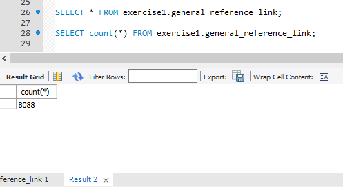
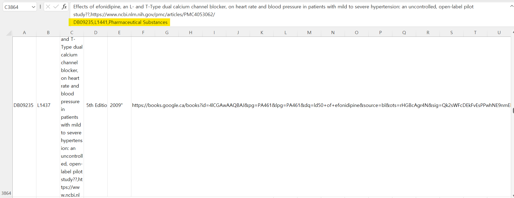
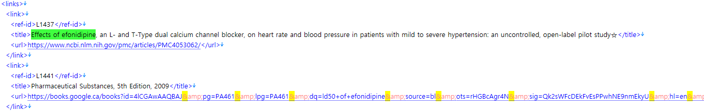
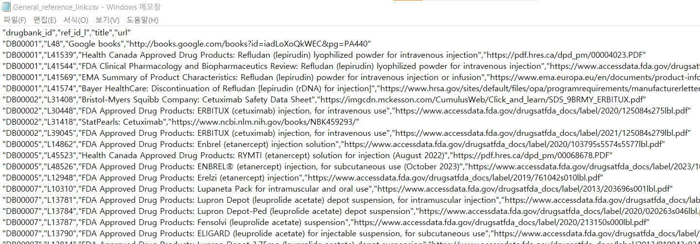
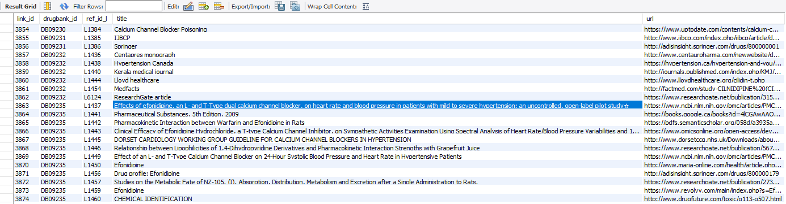



## Intro

MySQL에서 csv를 `LOAD DATA LOCAL INFILE` 명령어를 이용해 import하던 중 여러 오류가 발생했다. 예를 들면 `local_infile`을 활성화해주는 문제, 데이터 타입이 안 맞아서 생기는 오류, 혹은 데이터가 변수 크기에 못 들어가서 잘리는 오류 등 여러 가지 문제 상황들을 마주쳤다. 그 많은 문제들 중에서 CSV 행 개수와 MySQL에 올린 데이터의 행 개수가 불일치하는 문제를 다루고자 한다.

여담으로 원래 Table Data Import Wizard를 통해 편하게 하려 했으나, GB가 넘는 데이터도 아닌데 시간이 오래 걸렸고 필드 구분이 이상하게 잘리는 등 여러 가지 이유로 `LOAD DATA LOCAL INFILE` 명령어를 이용해 CSV를 import했다.

## Problem

문제 상황은 이렇게 발생했다. 분명 `General_reference_link`는 CSV 파일에서 8088개의 레코드였다. 맨 위 인덱스를 빼면 MySQL에서 `count(*)`를 했을 시 8087개가 나와야 한다. (코드에서 첫 번째 행을 무시하기로 했으므로) 그런데 왠걸…? 8088개가 나왔다.



행 개수가 늘어났다라는 건 어디선가 필드 구분이 잘못되었거나, 비어 있는 행이 추가되었거나, 어디선가 LF가 잘못되었다거나… 등을 의미한다. 어찌 되었든 반가운 상황이 아니다. 필드 구분이 잘못되어 밀린 상태로 데이터가 테이블에 올라갔다면 나중에 제약 조건을 설정할 때도 문제가 발생할 수 있기 때문이다.

그래서 잘못된 행을 찾아보기로 했다. (8088개밖에 안 되니까요…) 그렇게 csv 파일을 txt 파일로 열어서 뒤져보고 MySQL에서 `SELECT`문의 결과를 txt 파일로 export해 뒤져보던 중, 드디어 문제의 행을 찾아냈다. 바로 3864번째 행이었다.



문제가 되는 행을 찾는 건 그렇게 어렵지 않았다. 왜냐하면 밀린 곳만 찾으면 됐었기에 행을 비교해보면서 숫자가 어긋나 있는 부분과 그렇지 않은 부분의 경계를 좁혀나가면 되기 때문이다. 예를 들어 1번 행부터 4000번 행까지는 정상적으로 행이 쓰여져 있는데 8000번대는 행이 밀려 있다. 그렇다면 문제가 되는 부분은 4000번대부터 8000번대 행인 것이다. 이렇게 절반씩 줄여가며 범위를 좁히다 보니 문제가 되는 부분을 찾는 건 어렵지 않았다. 마치 내가 컴퓨터 알고리즘이 된 느낌이었다.

저기 형광펜으로 표시된 부분이 차례대로 `Drugbank_id`, `ref_id_l`, `title`인데, 이전 행의 title에 밀려 들어가 있어 문제가 발생했다. CSV 파일이 잘못되었다는 건 데이터 파싱에서 코드를 작성할 때 문제가 되었다는 뜻인데, 다른 행은 아무 문제가 없는데 왜 하필 저기만 문제를 발생한 걸까? XML을 뜯어보기로 했다.



문제가 되었던 부분이 저 부분인데, `<title>Effects of efonidipine, an L- and T-Type dual calcium channel blocker, on heart rate and blood pressure in patients with mild to severe hypertension: an uncontrolled, open-label pilot study☆</title>` 아마 특수문자를 처리하는 과정에서 문제가 발생한 것 같다. 그렇다면 코드를 작성하는 과정에서 특수문자를 어떻게 처리할까에 대한 논의로 문제가 바뀐다. 하필 또 특수문자가 라인 맨 끝에 있어서 줄 바꿈 과정에도 영향을 끼치지 않을까 의심된다.

## Solution

그래서 특수문자가 데이터 파싱에 영향을 미치지 않도록 처리하는 과정이 필요하다.

```python
# 원래 코드
li.to_csv("General_reference_link.csv", index=False)

# 수정된 코드
li.to_csv("General_reference_link.csv", index=False, quotechar='"', quoting=1)
```

CSV 파일 작성 시, 파이썬 `csv` 모듈의 `quotechar`와 `quoting` 옵션을 사용하여 줄 바꿈 문자나 특수문자가 포함된 데이터를 적절히 처리해야 한다.

- **`quotechar`**

  `quotechar` 옵션은 필드 값을 둘러싸는 데 사용되는 문자를 지정한다. 일반적으로 이 값은 쌍따옴표(`"`)이며, 이 옵션은 필드 값 내에 구분자(예: 쉼표), 줄 바꿈 문자 또는 다른 특수 문자가 포함되어 있을 때 해당 필드를 정확히 인식하고 구분하기 위해 사용된다. 예를 들어 데이터에 쉼표가 포함된 경우는 다음과 같다.

  ```text
  "이름", "나이", "좋아하는 음식"
  "홍길동", "20", "김치, 된장"
  ```

  여기서 `quotechar`는 쌍따옴표(`"`)로 설정되어 `"김치, 된장"`이 하나의 필드 값으로 인식되게 한다. 위 문제에서 `title`의 요소 값을 묶어 특수문자를 하나의 필드 값으로 인식되게 해준다.

- **`quoting`**

  `quoting` 옵션은 어떤 필드를 따옴표로 둘러싸야 하는지를 결정한다. `quoting=1`로 설정하는 경우, Python의 `csv` 모듈에서 이는 `csv.QUOTE_ALL` 상수에 해당하고, 이는 모든 필드가 따옴표로 둘러싸여져야 함을 의미한다. 즉, CSV 파일을 작성할 때 모든 필드 값이 따옴표(`"`)로 감싸진다.

  

  이렇게 모든 필드가 따옴표로 감싸지면 뭐가 좋냐? CSV 파일 내에서 줄 바꿈 문자가 포함된 데이터를 처리할 때 매우 유용하다. 필드 값 자체에 줄 바꿈 문자가 포함될 경우, 이를 `quoting` 옵션을 사용하여 정확하게 인식하고 처리할 수 있다.

## Solved

이렇게 수정된 CSV 파일은 8089개의 레코드를 가지고 있었으며 위에서 행이 분리가 안 되었던 문제를 해결해줬다. 그리고 MySQL에 import했을 때 아래와 같이 특수문자까지 잘 출력이 되는 모습을 확인할 수 있었다. 당연히 행의 개수도 8088개로 일치함을 확인할 수 있었다. (8089개에서 인덱스 행을 제외했으므로)



```text
'3863', 'DB09235', 'L1437', 'Effects of efonidipine, an L- and T-Type dual calcium channel blocker, on heart rate and blood pressure in patients with mild to severe hypertension: an uncontrolled, open-label pilot study☆', 'https://www.ncbi.nlm.nih.gov/pmc/articles/PMC4053062/'
```

## Outro

참 힘든 여정이었다… XML 데이터 파싱 시 잘못된 과정이 존재했음에도 불구하고 올바르게 들어간 MySQL에 감사할 뿐이다. CSV로 열었을 때는 합쳐져 있던 데이터가 메모장으로 열었을 때 왜 바르게 보이는지에 대해서는 추후 공부가 필요할 듯싶다. 아마 Line-Feed와 관련된 내용일 듯하다. LF라는 용어를 처음 접한 건 아니다. GitHub에 코드를 올릴 때 운영체제의 차이 때문에 Line-Feed를 어떻게 할 거냐라는 경고 메시지가 뜨긴 하는데, 이 Line-Feed가 데이터 영역에서도 중요한 쟁점이 될 줄은 몰랐다. 줄 바꿈에 대해 나중에 한번 파보도록 하겠다!
