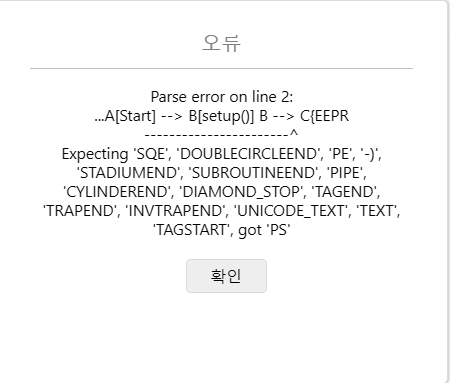
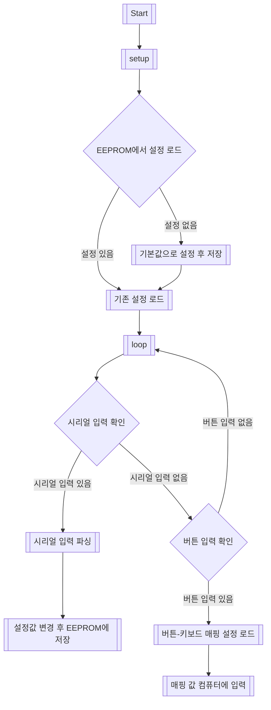



## Outline

임베디드 소프트웨어 프로젝트에서 아두이노 코드를 플로우차트로 그리기 위해 Mermaid 코드를 사용하던 중 아래와 같은 오류가 발생했습니다.



## Cause

문제가 발생한 원인은 아래 Mermaid 코드에서 특수 문자인 `(`를 이스케이프 처리하지 않았기 때문입니다. (아래는 오류가 발생하는 코드라 렌더링하지 않고 원문 그대로 보여줍니다.)

```text
graph TD;
    A[Start] --> B[setup()]
    B --> C{EEPROM에서 설정 로드}
    C --> |설정 없음| D[기본값으로 설정 후 저장]
    C --> |설정 있음| E[기존 설정 로드]
    D --> E
    E --> F[loop()]

    F --> G{시리얼 입력 확인}
    G --> |시리얼 입력 있음| H[시리얼 입력 파싱]
    H --> I[설정값 변경 후 EEPROM에 저장]
    G --> |시리얼 입력 없음| J{버튼 입력 확인}
    J --> |버튼 입력 있음| K[버튼-키보드 매핑 설정 로드]
    K --> L[매핑 값 컴퓨터에 입력]
    J --> |버튼 입력 없음| F
```

## Solution

`(`를 이스케이프 처리해서 코드를 다시 작성해주면 문제를 해결해줄 수 있습니다. 아래는 수정된 코드이며, 실제로 렌더링된 다이어그램입니다.



## Solved

**특수문자 이스케이프 처리.** 누군가에게는 간단한 오류로 쉽게 해결할 수 있는 문제이며, 이걸 굳이 기록으로 남길 필요가 있을까라는 의문이 들기도 할 것입니다. 하지만 제가 글을 쓰는 이유는 특수문자 이스케이프 처리에 대한 경각심을 갖기 위함입니다.

저는 개인적으로 특수문자 이스케이프라는 개념을 예전 MySQL을 다룰 때 처음 접했습니다. 그때는 '아 이런 오류가 있구나' 하고 넘어가는 정도였는데, 특수문자를 처리하지 않았을 때 다른 환경(Mermaid Code)에서도 똑같은 오류가 발생하는 것을 보고 확실히 짚고 넘어가야겠다는 생각이 들었습니다. 그래서 글을 작성하게 되었습니다.

**이스케이프**란 Computer Science에서 특정 문자가 가진 원래의 의미를 잠시 무시하고 다른 목적으로 사용하게 하는 방법을 의미합니다. 예를 들어 문자열 내에서 따옴표(`"`)는 문자열의 시작과 끝을 의미합니다. 하지만 문자열 내에 따옴표(`"`)를 포함하고 싶을 때는 어떻게 해야 할까요? 이럴 때 쓰는 방법이 특수문자 이스케이프 처리입니다. 파이썬 환경이라면 특수문자 앞에 역슬래시를 붙여 쉽게 해결할 수 있습니다.

```python
string = "He said, \"Hello!\""
print(string)  # 출력: He said, "Hello!"
```

또 하나의 예로 HTML에서는 엔터티 표현을 사용해 특수문자를 이스케이프 처리합니다. 이와 관련된 내용은 [왜 HTML에서 특수문자를 엔터티 표현으로 사용해야 할까?](/html-entity-special-characters/) 글을 참고해 주세요.

지금까지 특수문자를 이스케이프하는 이유와 방법, 그리고 이 사소한 오류를 인지하며 경각심을 갖자는 내용이었습니다. 사소하고 반복되는 오류의 확실한 인지를 통해 프로그래밍 시 오류를 줄이고 트러블슈팅 시간의 감소를 기대할 수 있습니다.

## Reference

- [이스케이프 란? (velog)](https://velog.io/@nbghza/이스케이프-란)
- [Mermaid diagram escape invalid characters (Stack Overflow)](https://stackoverflow.com/questions/77964627/mermaid-diagram-escape-invalid-characters)
