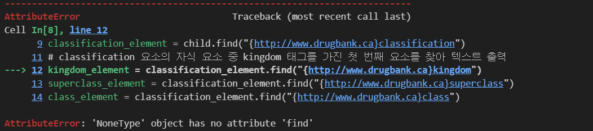
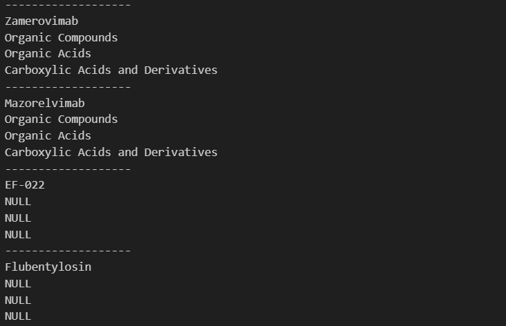



## Error

```python
for child in root.findall("{http://www.drugbank.ca}drug"):
    element = child.find("{http://www.drugbank.ca}name")

    # 각 <drug> 요소의 자식 요소 중에서 {http://www.drugbank.ca}classification 태그를 가진 첫 번째 요소 탐색
    classification_element = child.find("{http://www.drugbank.ca}classification")

    # classification 요소의 자식 요소 중 kingdom 태그를 가진 첫 번째 요소를 찾아 텍스트 출력
    kingdom_element = classification_element.find("{http://www.drugbank.ca}kingdom")
    superclass_element = classification_element.find("{http://www.drugbank.ca}superclass")
    class_element = classification_element.find("{http://www.drugbank.ca}class")

    print("-------------------")
    print(element.text) #name
    print(kingdom_element.text) #kingdom
    print(superclass_element.text) #superclass
    print(class_element.text) #class
```



`root(drugbank)` 아래에 있는 모든 `<drug>` 요소 중에서, `<classification>`의 모든 자식 요소를 찾는 도중 위와 같은 오류가 발생했습니다.

```xml
<drugbank>
	<drug>
		<classification>
		</classification>
	</drug>
</drugbank>
```

## Cause

위 오류가 발생하는 이유는 다음과 같습니다. 자식 요소를 가져오는 과정에서 classification이 `<drug>`에 존재하지 않을 경우 예외처리를 하지 않았기 때문에 발생합니다. classification이 `<drug>`에 존재하지 않을 경우 `find()` 메소드는 `None` 객체를 반환하게 되는데, `None` 객체 안에서는 `<kingdom>`이라는 요소를 찾을 수 없기에 오류가 발생하게 되는 겁니다. 즉, `classification_element`가 존재하지 않는 경우를 처리하지 않아서 오류가 발생합니다.

```xml
<drugbank>
	<drug>
		<classification>
		  <kingdom></kingdom>
		  <superclass></superclass>
		  <class></class>
		</classification>
	</drug>
	<drug>
	  <!-- classification이 존재하지 않는 drug -->
	</drug>
  <drug>
		<classification>
			<kingdom></kingdom>
		  <superclass></superclass>
		  <class></class>
		</classification>
	</drug>
</drugbank>
```

이 문제를 해결하려면 `classification_element`가 `None`이 아닌지 확인한 후에 `find()` 메서드를 호출해야 합니다.

## Solution

```python
# 예외처리
for child in root.findall("{http://www.drugbank.ca}drug"):
    element = child.find("{http://www.drugbank.ca}name")

    # 각 <drug> 요소의 자식 요소 중에서 {http://www.drugbank.ca}classification 태그를 가진 첫 번째 요소 탐색
    classification_element = child.find("{http://www.drugbank.ca}classification")

    print("-------------------")
    print(element.text) #name

    # classification_element가 None이 아닐 경우 자식 요소 반환
    if classification_element is not None:
        # classification 요소의 자식 요소 중 kingdom 태그를 가진 첫 번째 요소를 찾아 텍스트 출력
        kingdom_element = classification_element.find("{http://www.drugbank.ca}kingdom")
        superclass_element = classification_element.find("{http://www.drugbank.ca}superclass")
        class_element = classification_element.find("{http://www.drugbank.ca}class")
        # 자식 요소 중 값이 비어있을 경우 "None" 값 반환
        print(kingdom_element.text if kingdom_element is not None else "None") # kingdom
        print(superclass_element.text if superclass_element is not None else "None") # superclass
        print(class_element.text if class_element is not None else "None") # class
    else:
        print("NULL") # classification이 없는 경우
        print("NULL") # classification이 없는 경우
        print("NULL") # classification이 없는 경우
```

위와 같이 예외처리를 해줍니다. 아래와 같이 classification이 존재하지 않는 경우 `NULL`로 예외처리가 된 모습을 확인할 수 있었습니다.


