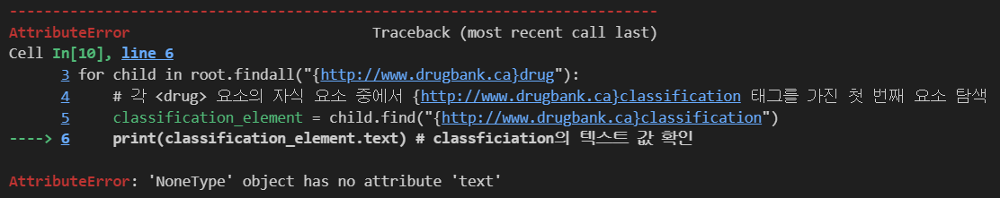
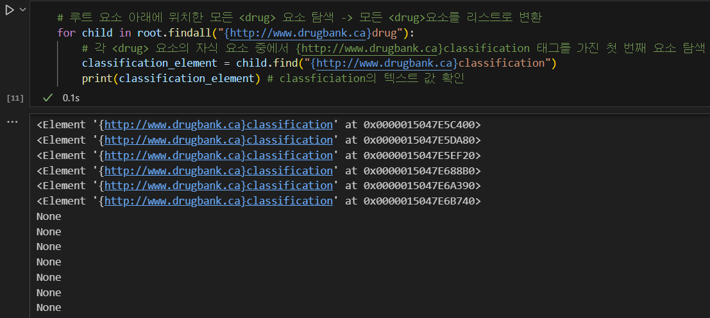
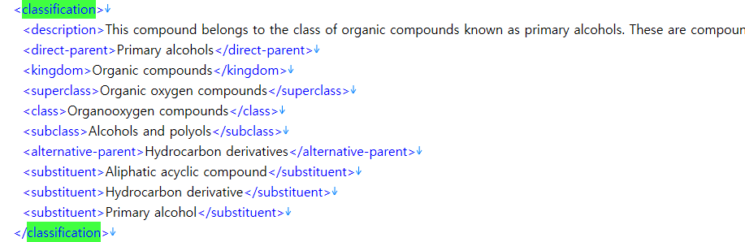
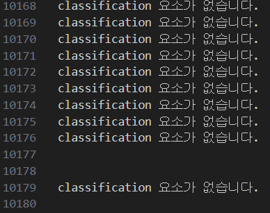



## Error

```python
# 루트 요소 아래에 위치한 모든 <drug> 요소 탐색 -> 모든 <drug>요소를 리스트로 변환
for child in root.findall("{http://www.drugbank.ca}drug"):
    # 각 <drug> 요소의 자식 요소 중에서 {http://www.drugbank.ca}classification 태그를 가진 첫 번째 요소 탐색
    classification_element = child.find("{http://www.drugbank.ca}classification")
    print(classification_element.text) # classification의 텍스트 값 확인
```



`root(drugbank)` 아래에 있는 모든 `<drug>` 요소 중 `<classification>` 태그를 가진 요소를 찾아 text로 출력하는 도중 위와 같은 오류가 발생했습니다.

## Cause

`'NoneType' object has no attribute 'text'` 오류는 `classification_element`가 `None`일 때 발생합니다. 이는 `child.find("{http://www.drugbank.ca}classification")` 메서드가 classification 요소를 찾지 못했을 때 `None`을 반환하게 되는데, 이때 `None` 객체에는 text 속성이 없기 때문에 오류가 발생합니다.



즉, root인 `<drugbank>` 아래 자식 요소인 `<drug>`가 존재하는데, 이 `<drug>` 요소 안에 `<classification>`이라는 요소가 있는 `<drug>`도 있고, 없는 `<drug>`도 존재하기 때문에 `classification_element.text`라는 구문은 오류가 발생하게 됩니다. 따라서 `<classification>` 요소 안의 값을 파싱하기 위해서는 예외처리가 필요하며, xml 파일에서 classification은 자식 요소를 갖고 있는 걸 확인할 수 있었습니다.



## Solution

```python
for child in root.findall("{http://www.drugbank.ca}drug"):
    # 각 <drug> 요소의 자식 요소 중에서 {http://www.drugbank.ca}classification 태그를 가진 첫 번째 요소 탐색
    classification_element = child.find("{http://www.drugbank.ca}classification")

    if classification_element is not None:
        print(classification_element.text)  # classification의 텍스트 값 확인
    else:
        print("classification 요소가 없습니다.")
```



위와 같이 결과가 나오게 되며 `<classification>` 아래 자식 요소가 존재하기 때문에 텍스트 값은 빈칸처럼 나오게 됩니다. 아래처럼 `<classification>` 안에서 다시 순회를 하며 값을 추출해줍니다.

```python
# 예외처리
for child in root.findall("{http://www.drugbank.ca}drug"):
    element = child.find("{http://www.drugbank.ca}name")

    # 각 <drug> 요소의 자식 요소 중에서 {http://www.drugbank.ca}classification 태그를 가진 첫 번째 요소 탐색
    classification_element = child.find("{http://www.drugbank.ca}classification")

    print("-------------------")
    print(element.text) #name

    if classification_element is not None:
        # classification 요소의 자식 요소 중 kingdom 태그를 가진 첫 번째 요소를 찾아 텍스트 출력
        kingdom_element = classification_element.find("{http://www.drugbank.ca}kingdom")
        superclass_element = classification_element.find("{http://www.drugbank.ca}superclass")
        class_element = classification_element.find("{http://www.drugbank.ca}class")

        print(kingdom_element.text if kingdom_element is not None else "None") # kingdom
        print(superclass_element.text if superclass_element is not None else "None") # superclass
        print(class_element.text if class_element is not None else "None") # class
    else:
        print("NULL") # classification이 없는 경우
        print("NULL") # classification이 없는 경우
        print("NULL") # classification이 없는 경우
```
