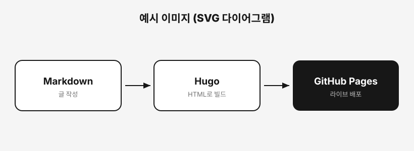
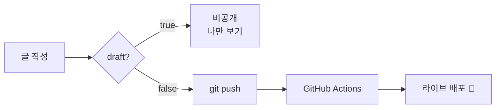

이 글은 블로그 글에 **다양한 콘텐츠**를 넣는 예시야. 각 문법을 그대로 따라 쓰면 돼. (확인하고 지워도 됨)

## 1. 코드 블록

백틱 3개로 감싸고 **언어 이름**을 붙이면 자동 하이라이트돼:

```java
@Transactional(readOnly = true)
public List<Member> findAll() {
    return memberRepository.findAll(); // 조회 전용 트랜잭션
}
```

```bash
git add . && git commit -m "새 글" && git push
```

## 2. 이미지

이미지 파일을 **글 폴더 안에 넣고** `` 으로 삽입:



> 위 이미지는 이 글 폴더의 `example-diagram.svg` 파일을 불러온 거야.

## 3. 플로우차트 (Mermaid) ⭐

`mermaid` 코드 블록을 쓰면 **다이어그램으로 자동 렌더**돼 (그림 파일 만들 필요 없음):



시퀀스 다이어그램도 가능:

```mermaid
sequenceDiagram
    참가자 as 방문자
    브라우저->>GoatCounter: 방문 1건 전송
    GoatCounter-->>위젯: 오늘/전체 숫자
```

## 4. GIF

GIF도 **이미지랑 완전히 똑같아** — 파일을 글 폴더에 넣고:

```text

```

화면 녹화 GIF(예: [Kap](https://getkap.co), LICEcap)를 넣으면 동작을 보여주기 좋아.

## 5. 표

| 넣을 것 | 문법 |
|---------|------|
| 코드 | 백틱 3개 + 언어 |
| 이미지 / GIF | `` |
| 플로우차트 | mermaid 코드 블록 |
| 표 | 파이프 `\|` 로 칸 나누기 |

## 6. 콜아웃 (알림 박스)

인용부호 `>` 뒤에 `[!NOTE]` 같은 태그를 붙이면 색깔 박스가 나와:

> [!NOTE]
> 참고용 노트 박스. 팁이나 부연 설명에.

> [!WARNING]
> 경고 박스. 주의할 점 강조에.

> [!TIP]
> 꿀팁 박스.

---

정리하면 **코드·이미지·GIF는 마크다운 기본 문법**, **플로우차트는 Mermaid 코드 블록**, **콜아웃은 `> [!TYPE]`** — 이게 전부야! 🌱
