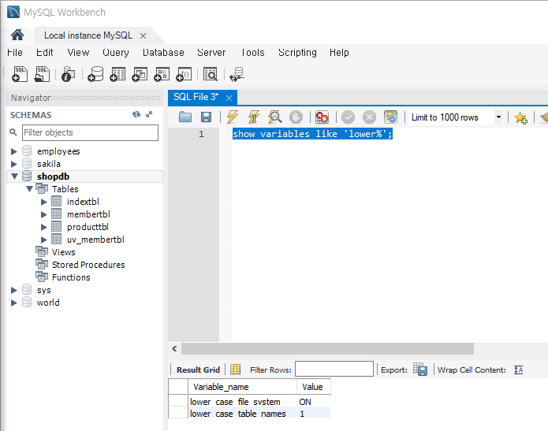



> [!TIP]
> 기본적으로 MySQL에서는 쿼리를 넣을 때 대소문자를 구분하지 않습니다.
>
> **하지만 보통 SQL을 작성할 때 가독성을 위해 `SELECT`, `JOIN`, `WHERE` 같은 예약어는 대문자로 사용하기를 권장합니다.** 개발용 소스코드에 들어가는 SQL의 경우 가독성을 위해서 코딩 표준에 예약어를 대문자로 강제하는 팀들도 있습니다.

- 윈도우에서는 테이블명을 설정할 때 대소문자 구분을 하지 않는 게 기본 설정이다. 하지만 리눅스는 대소문자를 구분하는 게 기본 설정이다.

```sql
show variables like 'lower%';
```



`lower_case_table_names`가 `1`이면 대소문자 구분을 안 하고, `0`이면 대소문자 구분을 한다는 의미입니다.
