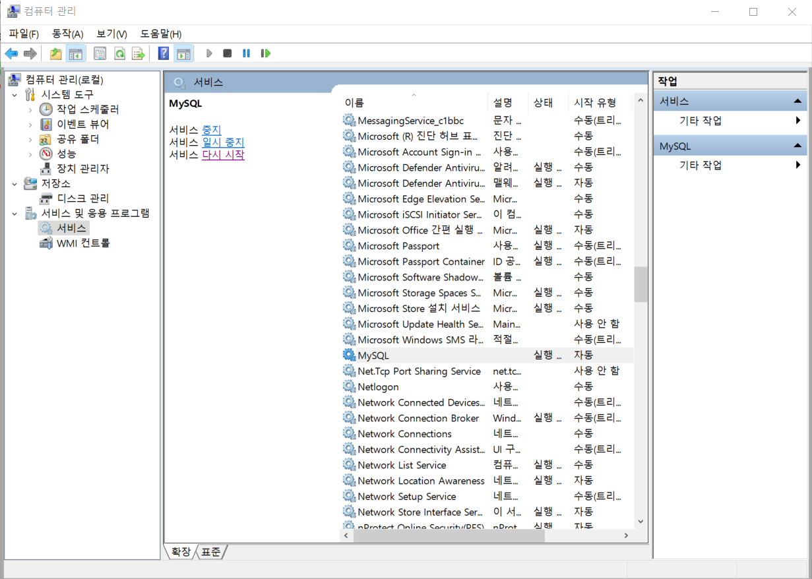
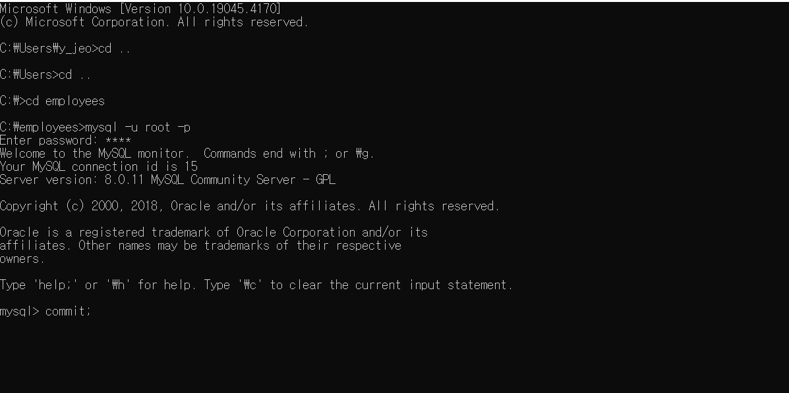
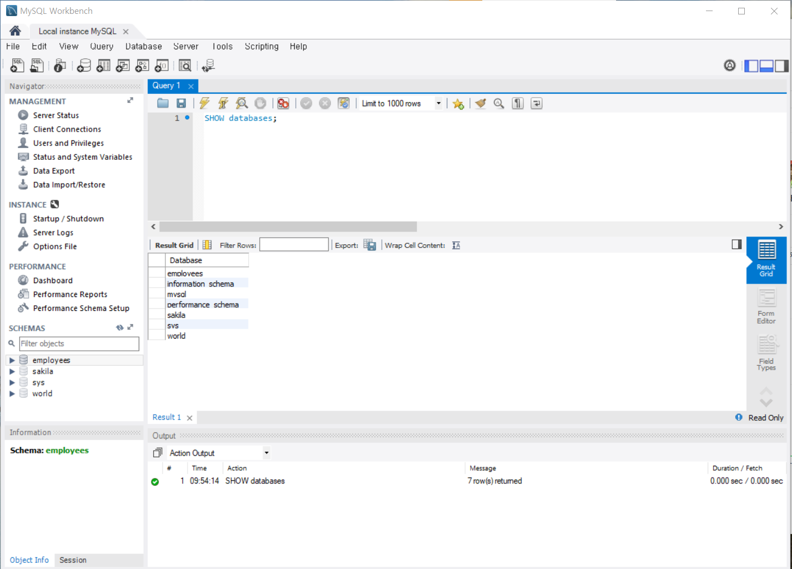



## Outline

패스워드를 입력하고 SQL 워크벤치를 실행하려 하자 다음과 같이 opening sql이 무한 로딩되는 이슈가 발생했습니다. (아니 조금만 기다리면 실행된다며;;; 혼자 3시간 기다렸습니다;;)

## Cause

원인은 팀원 혹은 개인이 DB를 조작한 후 정상 종료가 되지 않은 상태에서 MySQL을 실행하려 했기 때문입니다. 즉, 프로그램 내부에서 충돌이 일어나는 겁니다. 원래 조작하던 sql에서 정상 종료를 해줘야 문제를 해결할 수 있습니다.

## Solution

**1. 서비스 재시작**

여러 가지 솔루션들이 존재하겠지만 첫 번째로 찾아본 솔루션은 서비스 재시작입니다. 다음과 같이 `시작 - 컴퓨터 관리 - 서비스 및 응용 프로그램 - 서비스`에 들어가서 서비스를 재시작하면 됩니다.

하지만? 한 번에 해결되면 재미가 없죠? 역시나 어림도 없습니다. SQL이 정상 종료가 되지 않아서 발생한 문제라면 이전에 했던 작업과 관련이 있을 거라 생각했습니다. (이전에 명령 프롬프트에서 외부 sql을 불러와 실행한 적이 있는데 이 작업이 제대로 마무리되지 않은 것 같습니다.)

**2. COMMIT**

위와 같이 이전에 작업했던 디렉토리에서 `commit`을 수행해줬습니다.

## Solved

아니나 다를까 언제 그랬냐는 듯 정상 수행되는 모습을 확인할 수 있었습니다. 여러 가지 방법들이 있었지만 저에게는 `COMMIT`을 통해 해결하는 방법이 효과적이었습니다.

