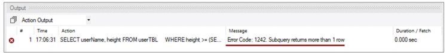
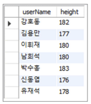



## Outline

서브쿼리를 이용해 결과를 추출하는 과정에서 다음과 같은 오류가 발생했습니다.

```sql
SELECT userName, height FROM userTBL
WHERE height >= (SELECT height FROM userTBL WHERE addr = '경기');
```



## Cause

서브쿼리는 단일 행 혹은 복수 행 비교 연산자와 사용 가능합니다. 그중 단일 행 비교 연산자를 사용했을 경우 결과가 반드시 1개 이하여야 합니다. 즉, 찾고자 하는 결과가 1개보다 많았기 때문에 발생하는 오류입니다.

- 단일 행 비교 연산자: `=`, `<`, `>`, `<>`
- 다중 행 비교 연산자: `IN`, `ALL`, `ANY`, `SOME`

더 자세한 내용은 SQLD 2장 4절을 참조해주시기 바랍니다.

## Solution

`ANY` 구문으로 고친 후 다시 실행해줍니다.

```sql
SELECT userName, height FROM userTBL
WHERE height >= ANY (SELECT height FROM userTBL WHERE addr = '경기');
```


