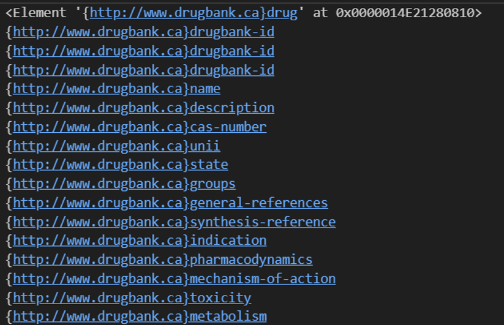



## Outline

데이터베이스 시스템 학과 수업에서 XML 데이터를 파싱하는 과제가 있었습니다. 이때 XML 파일에서 네임 스페이스(namespace)라는 개념을 처음 접했는데, 네임스페이스가 과연 뭐 하는 애인지 알아보도록 하겠습니다!! 🤔

```xml
<drugbank xmlns="http://www.drugbank.ca" xmlns:xsi="http://www.w3.org/2001/XMLSchema-instance" xsi:schemaLocation="http://www.drugbank.ca http://www.drugbank.ca/docs/drugbank.xsd" version="5.1" exported-on="2024-03-14">
<!-- 네임스페이스 xmlns="http://www.drugbank.ca" -->
<drug type="biotech" created="2005-06-13" updated="2024-01-02">
  <drugbank-id primary="true">DB00001</drugbank-id>
  <drugbank-id>BTD00024</drugbank-id>
  <drugbank-id>BIOD00024</drugbank-id>
  <name>Lepirudin</name>
```



## 네임스페이스란?

**XML 파일에서 네임스페이스는 태그 이름끼리 충돌을 방지하기 위해 사용되며 URI로 식별됩니다.** 이렇게만 말하면 어려우니 예를 들어 살펴보겠습니다.

<details>
<summary>URI란?</summary>

URI란 통합 자원 식별자를 의미하며, 인터넷에 있는 자원을 나타내는 유일한 주소를 의미합니다. URI의 존재는 인터넷에서 요구되는 기본 조건으로서 인터넷 프로토콜에도 항상 명시됩니다. 가장 잘 알려진 URI로는 인터넷 도메인 주소를 나타내는 URL(Uniform Resource Locator)이 있습니다.

</details>

```xml
<document>
    <title>책 제목</title>
    <author>홍길동</author>
    <title>기사 제목</title>
    <author>김철수</author>
</document>
```

위 예시에서는 title과 author 태그가 두 번씩 사용되었으나, title과 author가 어떤 document에 관한 것인지 구분할 수 없습니다. 네임스페이스를 사용해 다음과 같이 해결할 수 있습니다.

```xml
<document xmlns:book="http://www.example.com/books" xmlns:article="http://www.example.com/articles">
    <book:title>책 제목</book:title>
    <book:author>홍길동</book:author>
    <article:title>기사 제목</article:title>
    <article:author>김철수</article:author>
</document>
```

`book`과 `article`이라는 네임스페이스 접두사를 사용하여 각각의 태그가 어떤 것과 관련되어 있는지 명확히 구분할 수 있습니다. 이런 식으로 네임스페이스는 태그 이름 간의 충돌을 방지해줍니다.

## XML 네임스페이스의 선언

XML에서는 접두사(prefix)를 이용하여 동일한 태그 이름 간의 충돌을 방지합니다. XML에서 접두사를 사용하려면 반드시 접두사에 대한 네임스페이스를 선언해야 합니다. 선언하는 문법은 다음과 같습니다.

```xml
<요소이름 xmlns:prefix="URI">
<document xmlns:book="http://www.example.com/books">
```

예시 1번은 아래와 같이 표현될 수도 있으며, 이때는 해당 요소의 모든 자식 요소에도 같은 네임스페이스가 선언됩니다.

```xml
<root xmlns:book="http://www.example.com/books" xmlns:article="http://www.example.com/articles">
  <book:document>
    <book:title>책 제목</book:title>
    <book:author>홍길동</book:author>
  </book:document>
  <article:document>
    <article:title>기사 제목</article:title>
    <article:author>김철수</article:author>
  </article:document>
</root>
```

## Summary

XML에서는 사용자가 XML 요소(태그)의 이름을 직접 정의하기 때문에 서로 다른 XML 문서를 통합하려고 할 때 같은 이름을 가진 요소로 인해 충돌이 발생할 수 있습니다. 이런 충돌을 해결해 주는 게 네임 스페이스입니다. 이러한 네임스페이스는 URI를 통해 식별이 가능하며, 접두사를 이용해 동일한 태그 이름 간 충돌을 방지합니다.
